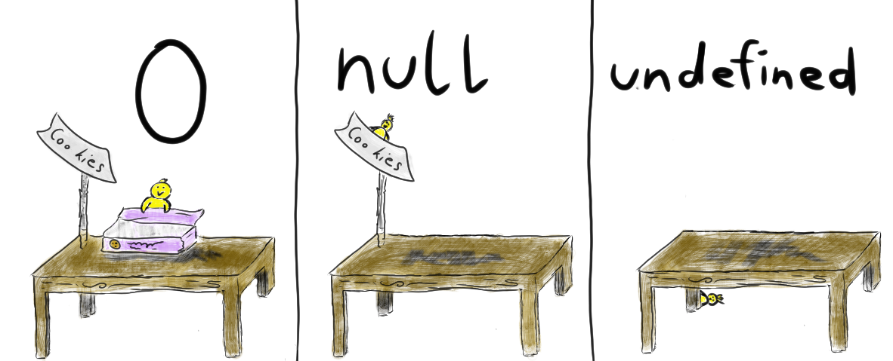
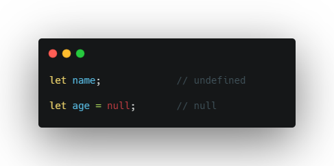
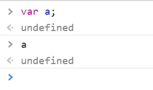

 #   Java Script: Differences between Null and Undefined.

##  Introduction

### - In JavaScript, null and undefined are two  values used to represent empty or non-existent values. 

## Null
* In JavaScript, null is a primitive. It is used to indicate that a variable or object property has no value.

For example:
javascript
* let myVariable = null;
* console.log(myVariable);  
* // Output: null

##  Undefined
* Undefined in JavaScript represents variables or object properties that have been declared but have not been assigned a value.

Consider the following example:
javascript
let myVariable;
console.log(myVariable);  // Output: undefined

##  Comparison with false
In JavaScript, false is a Boolean value representing "false". Let's compare null and undefined with false using the equality operators.

###  false == Null
When using the double equals (==) operator, which performs type coercion, false == null evaluates to false.

javascript
console.log(false == null);  // Output: false

###  Undefined == false
Similarly, when comparing undefined with false using the double equals (==) operator, it also evaluates to false.

javascript
console.log(undefined == false);  // Output: false

##  Conclusion 

let myVariable = null;
console.log(myVariable);  // Output: null

let myVariable;
console.log(myVariable);  // Output: undefined

console.log(false == null);  // Output: false
console.log(undefined == false);  // Output: false